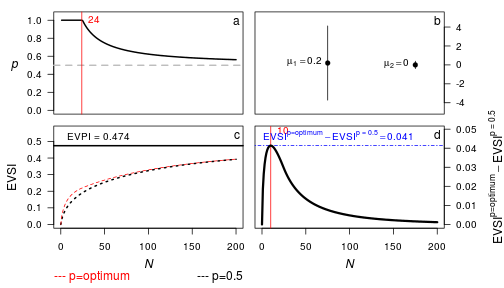
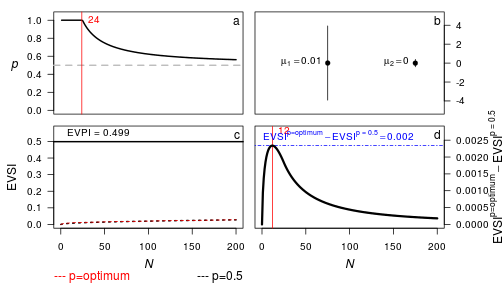
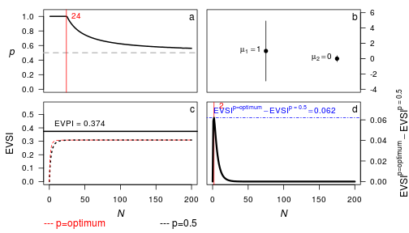
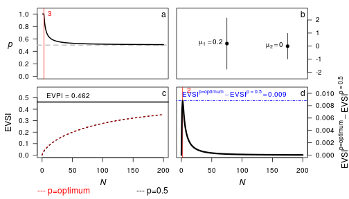
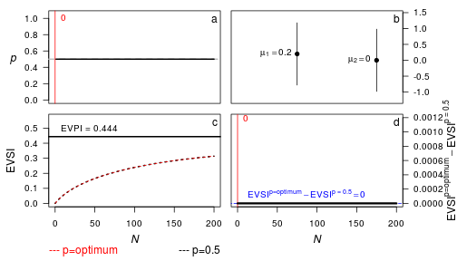
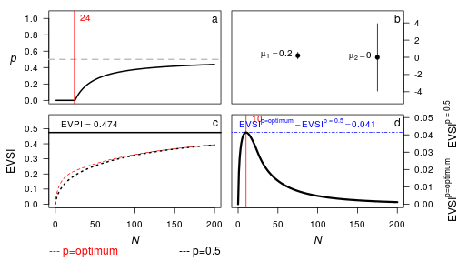

\newpage
\captionsetup{labelformat=empty}

# Appendix C: VOI for conservation auctions heuristic solution _n_ = 2 {-}

__Priors__

Let $A_1$ and $A_2$ be two assets. Each has some cost efficiency $c_1$ and $c_2$, both of which are uncertain with prior probability distributions,

\begin{equation}
c_1\sim\mathcal{N}(\mu_1, \sigma_1)
(\#eq:c1)
\end{equation}

and

\begin{equation}
c_2\sim\mathcal{N}(\mu_2, \sigma_2)
(\#eq:c2)
\end{equation}

where $\mu_1$ and $\mu_2$ are the prior means and $\sigma_1$ and $\sigma_2$ are the prior standard deviations. 

Let $\pi=\Pr(c_1 > c_2)$ and therefore,

\begin{equation}
\pi = \Phi\left(\frac{\mu_1-\mu_2}{\sqrt{\sigma^2_1+\sigma^2_2}}\right)
(\#eq:c2)
\end{equation}

__Utilities__

If $\pi > 1 - \pi$ then the optimal action is to purchase asset $A_1$, otherwise it is to purchase $A_2$.

We can assign utilities to each combination of the condition of $c_1$ and $c_2$, and each action such that,

\begin{equation}
\begin{aligned}
u(c_1 > c_2, A_1)&=1\\
u(c_1 < c_2, A_1)&=0\\
u(c_1 > c_2, A_2)&=0\\
u(c_1 < c_2, A_2)&=1\\
\end{aligned}
(\#eq:utilitiesapen)
\end{equation}

Therefore the expected values of taking each action are $\mathrm{E}[u(A_1)]=\pi$ and $\mathrm{E}[u(A_2)]=1-\pi$.

__Value of perfect information__

If we could reduce the uncertainty in the prior probabilites of $c_1$ and $c_2$ such that $\pi$ approached either limit, then the expected value of perfect information is,

\begin{equation}
\mathrm{EVPI}=1-\max(\pi, 1-\pi)=\min(\pi, 1-\pi)
(\#eq:evpiaucapen)
\end{equation}

__Preposterior analysis__

Now let's assume we can sample from some process and learn about $c_1$ and $c_2$.  
Let $X_1$ and $X_2$ be observations from a process described by the following sampling distributions,

\begin{equation}
X_1\sim\mathcal{N}\left(c_1, 1\right)
(\#eq:x1)
\end{equation}

and

\begin{equation}
X_2\sim\mathcal{N}\left(c_2, 1\right)
(\#eq:x2)
\end{equation}

where for simplicity the standard deviation is one.

Furthermore, we can make $Mp$ and $M(p-1)$ observations of $X_1$ and $X_2$ respectively. Where $M$ is the total number of samples the budget allows and $p$ and $p-1$ are proportions of that budget allocated to each assets.
Given the observations of $X_1$ and $X_1$ with sample sizes $Mp$ and $M(p-1)$ we can update the prior beliefs in $c_1$ and $c_2$ and arrive at posterior distributions,

\begin{equation} 
\begin{aligned}
c_1^\prime &\sim \mathcal{N}(\mu^\prime_1, \sigma^\prime_1)\\
c_2^\prime &\sim \mathcal{N}(\mu^\prime_2, \sigma^\prime_2)
\end{aligned}
(\#eq:posteriorcs)
\end{equation}

where,

\begin{equation}
\begin{aligned}
\mu^\prime_1 &= \frac{\mu_1 + X_1Mp\sigma^2_1}{Mp\sigma^2_1 + 1}\\
\sigma^\prime_1 &= \sqrt{\frac{\sigma^2_1}{Mp\sigma^2_1 + 1}}\\
\mu^\prime_2 &= \frac{\mu_2 + X_2M(p-1)\sigma^2_2}{M(p-1)\sigma^2_2 + 1}\\
\sigma^\prime_2 &= \sqrt{\frac{\sigma^2_2}{M(p-1)\sigma^2_2 + 1}}
\end{aligned}
(\#eq:posteriormusig)
\end{equation}

__Value of sample information__

Now we make the simplifying assumptions that $\mathrm{E}[X_1]=\mathrm{E}[c_1]=\mu_1$ and $\mathrm{E}[X_1]=\mathrm{E}[c_1]=\mu_1=0$.

In this scenario the prior probability of $c_1>c_2$ is,

\begin{equation}
\pi=\Phi\left(\frac{\mu_1}{\sqrt{\sigma^2_1+\sigma^2_2}}\right)
(\#eq:priorpi)
\end{equation}

, and the posterior is

\begin{equation}
\pi^\prime=\Phi\left(\frac{\mu_1}{\sqrt{\frac{\sigma^2_1}{Mp\sigma^2_1 + 1}+\frac{\sigma^2_2}{M(p-1)\sigma^2_2 + 1}}}\right)
(\#eq:posteriorpi)
\end{equation}

We can now calculate the expected value of sample information,

\begin{equation}
\mathrm{EVSI}=\max(\pi^{\prime}, 1-\pi^{\prime})-\max(\pi, 1-\pi)
(\#eq:evsiaucapen)
\end{equation}

__Optimal sampling allocation__

With equations 10-12, for any given set of $\mu_1$, $\sigma_1$, $\mu_2$, and $M$ we can find the optimal allocation to sample for asset $A_1$, $p$ to maximise the value of sample information.

__Summary__

* Optimal allocation insensitive to ratio of $\mu_a$ to $\mu_b$.
* Optimal allocation sensitive to ratio of $\sigma_1$ to $\sigma_2$.
* Always preferential to sample asset with greater uncertainty.
* Solution is symmetrical.
* The $M$ at which you start to allocate sampling to both assets is proportional to the ratio of $\sigma_1$ to $\sigma_2$.
* The $M$ at which you start to allocate sampling to both assets is insensitive to whether  $\sigma_1 < \sigma_2$ or $\sigma_1 > \sigma_2$.
* Optimal allocation always has greater EVSI when $\sigma_1 \neq \sigma_2$.

__$\mu_1 > \mu_2, \sigma_1 \gg \sigma_2$__

First let's examine the case where our prior belief is that $c_1$ is somewhat greater than $c_2$, where $\mu_1=.2$ and $\mu_2 = 0$ but the uncertainty in $\theta_1$ is far greater than in $\theta_2$, $\sigma_1 = 2$ and $\sigma_2 = .2$.

\clearpage

In this case, until we can take more than a total of 24 samples ($N=24$) the optimal allocation is to allocate all sampling effort to asset $A_1$ (a). With a total budget greater than 24 samples, we start allocating sampling to asset $A_2$ at a diminishing rate with total sample size and asymptoting at $p=0.5$. The expected value of sample information (EVSI) increases with sample size with diminishing returns asymptoting below the EVPI (c). At all sample sizes, the optimal allocation has greater expected value than naive assumption of constant allocation of $p=0.5$. The greatest benefit of allocating optimally is when the sample size is $N=10$. As sample size increases the additional benefit of allocating optimally declines asymptotically as the optimal allocation approaches $p=0.5$ (d).

__$\mu_1 \simeq \mu_2, \sigma_1 \gg \sigma_2$__

Holding all the other parameters constant, let's examine a scenario where the prior expection of $c_1$ is only marginally better than $c_2$ (i.e., reduce $\mu_1$ to $.01$). 

\clearpage

We still allocate in the same way as before (a). The EVPI approaches its theoretical maxmimum of 0.5. But the value of sample information achievable for anything less than 200 samples is reduced to near zero (c). The shape of the additional benefit from optimal allocation is the same but the scale has reduced and the optimal value of N has increased meaning more samples must be taken to maxmise the additional gain in EVSI by using the optimal allocation vs the naive allocation of $p=0.5$ (d). 

__$\mu_1 \gg \mu_2, \sigma_1 \gg \sigma_2$__

All other parameters still the same, but now with $\mu_1=1$ much greater than $\mu_2$.

\clearpage

Still same optimal allocation (a). EVPI reduced as we start already more certain that $A_1$ is a better asset than $A_2$. The return on investing in each additional sample diminishes quicker and sooner as EVSI asymptotes at nearer EVPI (c). The additional benefit in EVSI seen by sampling optimally has increased by peaks earlier at $N=2$ (d).

__$\mu_1 > \mu_2, \sigma_1 > \sigma_2$__

Resetting $\mu_1$ now we examine what happens when $\sigma_1$ is double $\sigma_2$.

\clearpage

The optimal allocation has the same shape as before but now we allocate sampling to asset $A_2$ sooner than before. Now if we take more than 3 samples we will allocate an increasing amount of them to asset $A_2$ (a). The EVPI has been reduced as we have started off more certain that $A_1$ is greater $A_2$ (c). There is less advantage to sampling optimally rather than the naive allocation but the point at which the additional benefit in EVSI peaks is at higher $N$ ($N=2$) than when $\sigma_1$ was much more than $\sigma_2$ (d).   

__$\mu_1 > \mu_2, \sigma_1 = \sigma_2$__

Now increase the precision of $c_1$ so that $\sigma_1 = \sigma_2$.

\clearpage

Now the optimal allocation is to just allocate evenly between the assets (i.e., the naive allocation is now optimal and there is effectively no advantage to optimize) (a). The allocation is still insentive to the value of $\mu_1$ and the value of $\sigma$'s. Decreasing the prior precisions increases EVPI, and with it the point at which EVSI vs $N$ asymptotes, but without changing the rate EVPI increases with $N$. Increaseing the value of $\mu_1$ decreases EVPI (but less sensitively than changing the precision) and also increases the rate at which EVPI vs $N$ approaches EVPI (c).

__$\mu_1 > \mu_2, \sigma_1 \ll \sigma_2$__

Returning to the original paramterisation now reverse the prior precisions so that $\tau^\prime_a$ is much greater than $\tau^\prime_b$.

\clearpage

The allocation is the same but now reflected so that we still allocate to the asset with more uncertainty (a). This applies no matter what the other parameter values are (i.e., the problem is symetrical).

\captionsetup{labelformat=default}
