\newpage
\captionsetup{labelformat=empty}

# Appendix D: VOI for conservation auctions heuristic solution _n_ = 3 {-}

__Priors__

Let $A_1$, $A_2$, $A_3$ be assets. Each has some value $c_1$, $c_2$, and $c_3$ which are uncertain with a joint prior probability distribution,

\begin{equation}
\begin{bmatrix}c_1 \\ c_2 \\ c_3\end{bmatrix}\sim\mathcal{N}\left(\begin{bmatrix}\mu_1 \\ \mu_2 \\ \mu_3\end{bmatrix}, \begin{bmatrix}\sigma^2_1 & 0 & 0 \\ 0 & \sigma^2_2 & 0\\ 0 & 0 & \sigma^2_3 \end{bmatrix}\right)
(\#eq:jointprior)
\end{equation}

where $\mu_1$, $\mu_2$, and $\mu_3$ are means and $\sigma_1$, $\sigma_2$ and $\sigma_3$ are the prior standard deviations. 

__Utilities__

We assign utilities to each rank order of $c_1$, $c_2$, and $c_3$ in combination with each action of purchasing one of $A$, $B$ or $C$,

\begin{equation}
\begin{aligned}
u(A_1, c_1 > c_2 > c_3)&=1\\
u(A_1, c_1 > c_3 > c_2)&=1\\
u(A_1, c_2 > c_1 > c_3)&=0.5\\
u(A_1, c_3 > c_1 > c_2)&=0.5\\
u(A_1, c_2 > c_3 > c_1)&=0\\
u(A_1, c_3 > c_2 > c_1)&=0\\
u(A_2, c_2 > c_1 > c_3)&=1\\
\mathrm{etc...}&
\end{aligned}
(\#eq:utilitiesapen2)
\end{equation}

such that utility is maximised when we purchase the highest ranked asset, zero when we purchase the lowest ranked and somewhere inbetween when we purchase the middle ranked asset.

__Ranking probabilties__

We can express the probability of any assets being in a given rank order as the probabililty of two differences being less than zero. Such that, for example,

\begin{equation}
\Pr(c_1 > c_2 > c_3) = \Pr(c_2 - c_1 < 0,  c_3 - c_2 < 0)
(\#eq:probrankapen)
\end{equation}

Given this we define two new variables, $z_1$ and $z_2$ where 

\begin{equation}
\begin{aligned}
  z_1 &= c_2 - c_1,\\
  z_2 &= c_3 - c_2
\end{aligned}
(\#eq:z12apen)
\end{equation}

Even if $c_1$, $c_2$, and $c_3$ are all uncorrelated $z_1$ and $z_2$ will not be, where

\begin{equation}
\mathrm{cov}(z_1, z_2)=\mathrm{cov}(c_1, c_2) - \mathrm{var}(c_2) - \mathrm{cov}(c_1, c_3) + \mathrm{cov}(c_2, c_3)
(\#eq:covz)
\end{equation}

Which, when $c_1$, $c_2$, and $c_3$ are all uncorrelated simplifies to

\begin{equation}
\mathrm{cov}(z_1, z_2)=-\mathrm{var}(c_2)
(\#eq:covz2)
\end{equation}

Therefore the joint distribution of $z_1$ and $z_2$ is,

\begin{equation}
\begin{bmatrix}z_1\\z_2\end{bmatrix}
  \sim\mathrm{N}\left(
  \begin{bmatrix}\mu_2-\mu_1\\\mu_3-\mu_2\end{bmatrix},
  \begin{bmatrix}\sigma^2_1+\sigma^2_2&-\sigma^2_2\\-\sigma^2_2&\sigma^2_2+\sigma^2_3\end{bmatrix}\right)
(\#eq:jointzapen)
\end{equation}

To obtain $\Pr(c_1 > c_2 > c_3)$ we evalute the multivariate cumulative distribution function of $z_1$ and $z_2$,

\begin{equation}
\Phi(z_1,z_2)
(\#eq:phiz)
\end{equation}

within the limits, $-\infty$ and 0.

__Expected value of perfect information__

To calculate the prior expected utility of purchasing any asset, we weight the utilities for that action (eqn. 2) by the relevant probablities calculated from eqns. 3--9. For instance;

\begin{equation}
\begin{aligned}
  \mathrm{E}[u(A_1)] = & 1 \times \Pr(c_1 > c_2 > c_3) + 1 \times \Pr(c_1 > c_3 > c_2)\,+ \\
  &0.5 \times \Pr(c_2 > c_1 > c_3) + 0.5 \times \Pr(c_3 > c_1 > c_2)\,+ \\
  &0 \times \Pr(c_2 > c_3 > c_1) + 0 \times \Pr(c_3 > c_2 > c_1)
\end{aligned}
(\#eq:EuA1apen)
\end{equation}

The expected value of perfect information then is,

\begin{equation}
\mathrm{EVPI}=1-\max(\mathrm{E}[u(A_1)],\mathrm{E}[u(A_2)],\mathrm{E}[u(A_3)])
(\#eq:evpiapen2)
\end{equation}

__Updating__

Now suppose we can update the priors for $c_1$, $c_2$, and $c_3$ by taking $M$ samples from sampling distrubutions with, for simplicity, some fixed variance of 1 and centered on $\mu_1$, $\mu_2$ and $\mu_3$ respectively. Further, we can define $p_1$ and $p_2$ as the proportion of the $M$ samples allocated to sampling for $A_1$ and $A_2$ respectively with $1 - p_1 - p_2$ being allocated to $A_3$. We can then use these samples to update the priors for $c_1$, $c_2$, and $c_3$ to obtain preposterior estimates, $c^\prime_1$, $c^\prime_2$, and $c^\prime_3$, where,

\begin{equation}
\begin{bmatrix}c^\prime_1 \\ c^\prime_2 \\ c^\prime_3\end{bmatrix}\sim\mathcal{N}\left(\begin{bmatrix}\mu_1 \\ \mu_2 \\ \mu_3\end{bmatrix}, \begin{bmatrix}\frac{\sigma^2_1}{Mp_1\sigma^2_1 + 1} & 0 & 0 \\ 0 & \frac{\sigma^2_2}{Mp_2\sigma^2_2 + 1} & 0\\ 0 & 0 & \frac{\sigma^2_3}{M(1 - p_1 - p_2)\sigma^2_3 + 1} \end{bmatrix}\right)
(\#eq:jointpost)
\end{equation}

__Expected value of sample information__

For any given new rank order, based on the updated preposterior distributions, we can again calculate a probablity by defining new variables (i.e., $z^\prime_1$ and $z^\prime_2$) and evalute their multivariate cumulative distribution as in eqns. 3--9. Therefore we can obtain the preposterior expected utilities for each purchase action by weighting the preposterior probablites by their respective utilities as in eqn. 10. Accordingly the expected vale of sample information is

\begin{equation}
\mathrm{EVSI}=\max(\mathrm{E}^\prime[u(A_1)],\mathrm{E}^\prime[u(A_2)],\mathrm{E}^\prime[u(A_3)])-\max(\mathrm{E}[u(A_1)],\mathrm{E}[u(A_2)],\mathrm{E}[u(A_3)])
(\#eq:evsiapen2)
\end{equation}

__Optimisation__

Using eqns 8-13 we can find the optimal values of $p_1$ and $p_2$ for any given $M$ that will maximise the EVSI. Below we examine a number of __Case studies for different sets of prior distrbutions for $c_1$, $c_2$ and $c_3$.

__Summary__

* Optimal allocation sensitive to ratios of $\mu$'s.
* Optimal allocation sensitive to ratio of $\sigma$'s.
* Not always preferential to sample asset with greater uncertainty.
* Solution is symmetrical.

__Case study 1: homogenous prior $\sigma$'s and homogenous prior means__

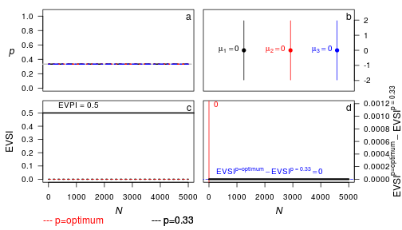
\clearpage

__Case study 2a: homogenous prior $\sigma$'s and heterogenous prior means__

$\mu_1 = \mu_2 > \mu_3$

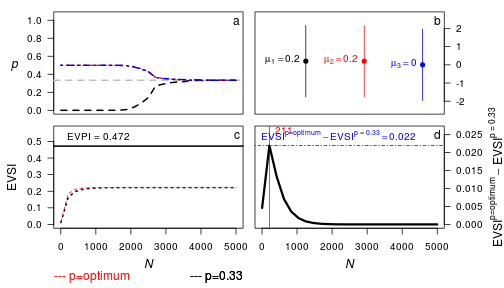
\clearpage

__Case study 2b: homogenous prior $\sigma$'s and heterogenous prior means__

$\mu_1 > \mu_2 = \mu_3$

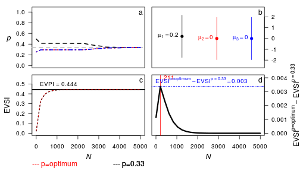
\clearpage

__Case study 2c: homogenous prior $\sigma$'s and heterogenous prior means__

$\mu_1 > \mu_2 > \mu_3$
  
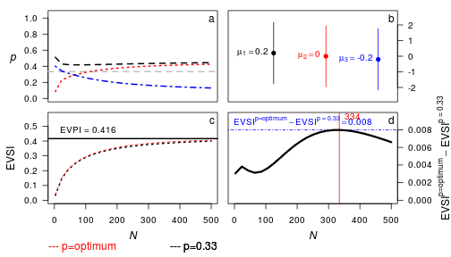
\clearpage

__Case study 3a: heterogenous prior $\sigma$'s and heterogenous prior means__

$\mu_1 > \mu_2 = \mu_3$

$\sigma_1 > \sigma_2 = \sigma_3$

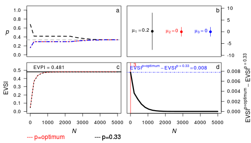
\clearpage

__Case study 3b: heterogenous prior $\sigma$'s and heterogenous prior means__

$\mu_1 > \mu_2 = \mu_3$

$\sigma_1 < \sigma_2 = \sigma_3$

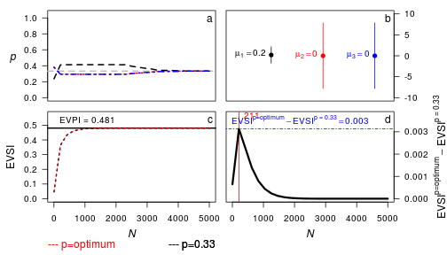
\clearpage

__Case study 3c: heterogenous prior $\sigma$'s and heterogenous prior means__

$\mu_1 = \mu_2 > \mu_3$

$\sigma_1 = \sigma_2 < \sigma_3$
  

\clearpage

__Case study 3d: heterogenous prior $\sigma$'s and heterogenous prior means__

$\mu_1 > \mu_2 = \mu_3$

$\sigma_1 = \sigma_2 > \sigma_3$

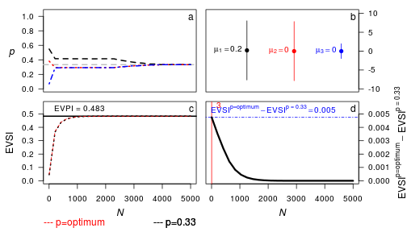
\clearpage

__Case study 3e: heterogenous prior $\sigma$'s and heterogenous prior means__

$\mu_1 > \mu_2 = \mu_3$

$\sigma_1 = \sigma_2 < \sigma_3$

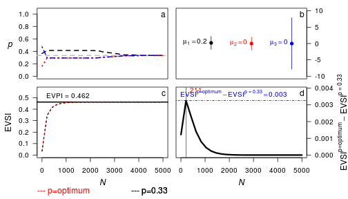
\clearpage

__Case study 3f: heterogenous prior $\sigma$'s and heterogenous prior means__

$\mu_1 = \mu_2 > \mu_3$

$\sigma_1 = \sigma_3 > \sigma_2$

\clearpage

__Case study 3g: heterogenous prior $\sigma$'s and heterogenous prior means__

$\mu_1 = \mu_2 > \mu_3$

$\sigma_1 = \sigma_3 < \sigma_2$

\clearpage

__Case study 3h: heterogenous prior $\sigma$'s and heterogenous prior means__

$\mu_1 > \mu_2 = \mu_3$

$\sigma_1 < \sigma_2 < \sigma_3$

\clearpage  

__Case study 3i: heterogenous prior $\sigma$'s and heterogenous prior means__

$\mu_1 > \mu_2 = \mu_3$

$\sigma_2 < \sigma_1 < \sigma_3$

\clearpage

__Case study 3j: heterogenous prior $\sigma$'s and heterogenous prior means__

$\mu_1 > \mu_2 = \mu_3$

$\sigma_1 > \sigma_2 > \sigma_3$

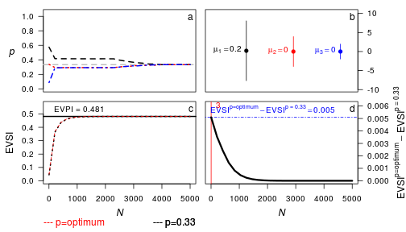
\clearpage

__Case study 3k: heterogenous prior $\sigma$'s and heterogenous prior means__

$\mu_1 = \mu_2 > \mu_3$

$\sigma_1 < \sigma_2 < \sigma_3$

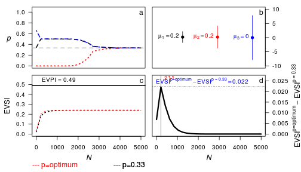
\clearpage

__Case study 3l: heterogenous prior $\sigma$'s and heterogenous prior means__

$\mu_1 = \mu_2 > \mu_3$

$\sigma_1 < \sigma_3 < \sigma_2$

\clearpage  

__Case study 3m: heterogenous prior $\sigma$'s and heterogenous prior means__

$\mu_1 = \mu_2 > \mu_3$

$\sigma_1 > \sigma_2 > \sigma_3$

\clearpage

__Case study 3n: heterogenous prior $\sigma$'s and heterogenous prior means__

$\mu_1 > \mu_2 > \mu_3$

$\sigma_1 < \sigma_2 = \sigma_3$

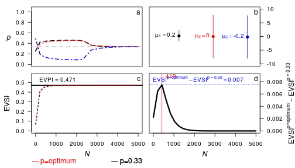
\clearpage

__Case study 3o: heterogenous prior $\sigma$'s and heterogenous prior means__

$\mu_1 > \mu_2 > \mu_3$

$\sigma_1 = \sigma_2 < \sigma_3$

\clearpage

__Case study 3p: heterogenous prior $\sigma$'s and heterogenous prior means__

$\mu_1 > \mu_2 > \mu_3$

$\sigma_1 = \sigma_3 > \sigma_2$

\clearpage  

__Case study 3q: heterogenous prior $\sigma$'s and heterogenous prior means__

$\mu_1 > \mu_2 > \mu_3$

$\sigma_1 = \sigma_2 < \sigma_3$

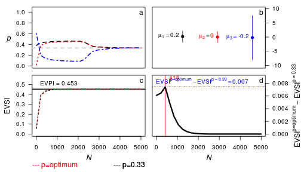
\clearpage

__Case study 3r: heterogenous prior $\sigma$'s and heterogenous prior means__

$\mu_1 > \mu_2 > \mu_3$

$\sigma_1 > \sigma_2 = \sigma_3$

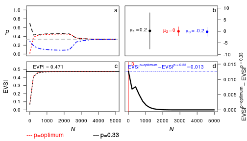
\clearpage

__Case study 3s: heterogenous prior $\sigma$'s and heterogenous prior means__

$\mu_1 > \mu_2 > \mu_3$

$\sigma_1 = \sigma_3 < \sigma_2$

\clearpage

__Case study 3t: heterogenous prior $\sigma$'s and heterogenous prior means__

$\mu_1 > \mu_2 > \mu_3$

$\sigma_1 < \sigma_2 < \sigma_3$

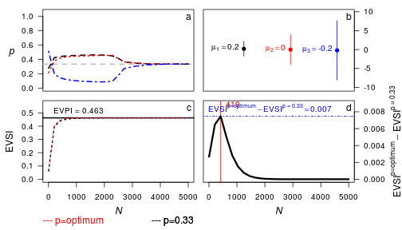
\clearpage  

__Case study 3u: heterogenous prior $\sigma$'s and heterogenous prior means__

$\mu_1 > \mu_2 > \mu_3$

$\sigma_2 < \sigma_1 < \sigma_3$

\clearpage

__Case study 3v: heterogenous prior $\sigma$'s and heterogenous prior means__

$\mu_1 > \mu_2 > \mu_3$

$\sigma_1 < \sigma_3 < \sigma_2$

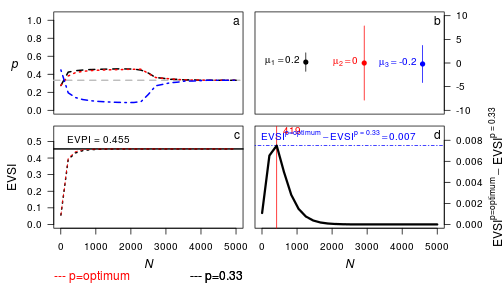
\clearpage

__Case study 3w: heterogenous prior $\sigma$'s and heterogenous prior means__

$\mu_1 > \mu_2 > \mu_3$

$\sigma_1 > \sigma_3 > \sigma_2$

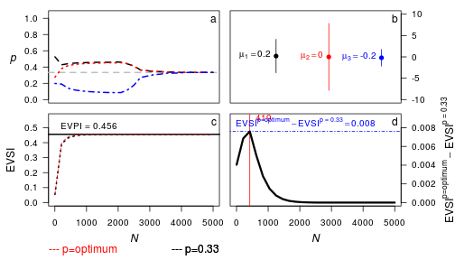
\clearpage

__Case study 3x: heterogenous prior $\sigma$'s and heterogenous prior means__

$\mu_1 > \mu_2 > \mu_3$

$\sigma_1 > \sigma_2 > \sigma_3$

\clearpage

\captionsetup{labelformat=default}
